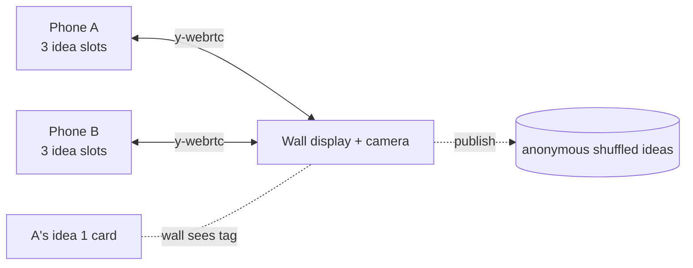

# mesh-brain-write

[](https://baditaflorin.github.io/mesh-brain-write/)
[](https://github.com/baditaflorin/mesh-brain-write/blob/main/package.json)
[](LICENSE)
[](docs/adr/0001-deployment-mode.md)

> Peer-to-peer mesh brainwrite: type up to 3 ideas privately on a synced timer, release into a shuffled anonymous pool, dot-vote for the top 3. ArUco mode for paper index cards.

**Live:** https://baditaflorin.github.io/mesh-brain-write/

A four-phase brainwriting flow over y-webrtc + Yjs:

1. **Write** (default 5 min) — see the prompt, type up to 3 ideas privately
   on your phone. Nothing is shared yet.
2. **Release** — everyone's ideas pool into a shuffled, anonymous list.
   No author, no order signal, no slot.
3. **Vote** — 3 dot votes per person.
4. **Results** — top 3 highlighted.

In ArUco mode, write each idea on a paper index card with a printed tag in
the corner; hold each card up to the wall camera during release to publish
that idea.

## How it works

1. Phones share a **Yjs document** over **y-webrtc**.
2. Pending ideas live in `Y.Map<peerId, { tagSlots }>` during the write
   phase — keyed by your stable per-device UUID. The UI shows only your own
   pending entries.
3. On release, the publish action atomically pushes texts into a flat
   anonymous `Y.Array<{ id, text }>` and clears your pending slots in the
   same Yjs transaction. The displayed order is a **deterministic shuffle**
   seeded by the session's release timestamp, so every phone sees the same
   order without one phone being authoritative.
4. Voting tracks `Y.Map<ideaId, Y.Map<peerId, true>>` to enforce 3 dots
   per person.

## Privacy threat model

See [docs/privacy.md](docs/privacy.md). Released ideas carry no peer
identity; pending entries are technically readable by other peers via
the CRDT but UI-hidden — this isn't a "your boss can debug-inspect
during a brainstorm" tool.

## Print the tag sheet

`npm run make-markers` produces:

- `public/markers/marker-{0..19}.png`
- `public/marker-sheet.pdf` — A4, 4×4 grid, IDs 0–15.

Hand each participant 3 cards (your choice of IDs). In Settings, bind each
tag ID to a slot (1, 2, or 3).

## Architecture

- **Mode A** — pure GitHub Pages.
- **WebRTC** — Yjs + y-webrtc with self-hosted signaling and TURN.
- **Clock sync** — median-offset mesh-time, identical countdown on every phone.
- **ArUco** — `js-aruco2` + `ARUCO_MIP_36h12`.



## Run it locally

```bash
git clone https://github.com/baditaflorin/mesh-brain-write.git
cd mesh-brain-write
npm install
npm run make-markers
npm run dev
```

## Build for Pages

```bash
npm run build
npm run pages-preview
```

The `docs/` output is committed to the repo. Pages serves from `main`,
`/docs`.

## Self-hosted infrastructure

| Repo                                                                   | Endpoint                               | Role                        |
| ---------------------------------------------------------------------- | -------------------------------------- | --------------------------- |
| [signaling-server](https://github.com/baditaflorin/signaling-server)   | `wss://turn.0docker.com/ws`            | y-webrtc protocol fan-out   |
| [turn-token-server](https://github.com/baditaflorin/turn-token-server) | `https://turn.0docker.com/credentials` | HMAC TURN creds, 1-hour TTL |
| [coturn-hetzner](https://github.com/baditaflorin/coturn-hetzner)       | `turn:turn.0docker.com:3479`           | TURN relay                  |

Override from the in-app Settings drawer.

## Settings (in-app)

- **Room ID**
- **Prompt** — the brainwrite question
- **Write duration (minutes)** — default 5
- **Publish mode** — tap or ArUco
- **This phone is the wall display** — toggle for the camera-running phone
- **Tag → idea slot bindings** — bind each printed tag to one of your 3 slots
- **Signaling / TURN URLs** — overrides

## ADRs

- [0001 — Deployment mode](docs/adr/0001-deployment-mode.md)
- [0002 — Phased state machine with privacy boundary](docs/adr/0002-phased-privacy-boundary.md)
- [0003 — ArUco tag slots per peer](docs/adr/0003-tag-slots-per-peer.md)
- [0010 — GitHub Pages publishing](docs/adr/0010-pages-publishing.md)

## License

[MIT](LICENSE) © 2026 Florin Badita
